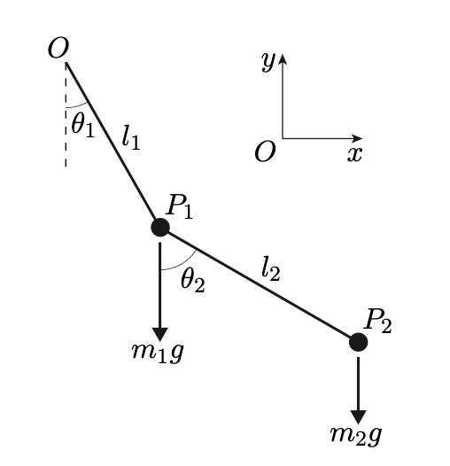
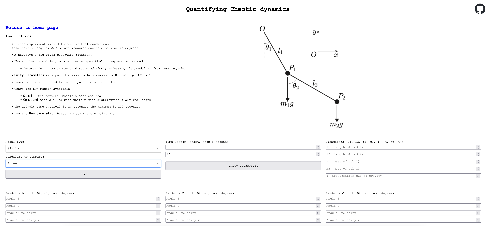

# Double Pendulum App

This project extends the [Double Pendulum Repo](https://github.com/pineapple-bois/Double_Pendulum), a Lagrangian formulation of the equations of motion of a double pendulum system. 

Available at:
[www.double-pendulum.net](http://www.double-pendulum.net)

----

#### The above figure shows simple pendulum suspended from another simple pendulum by a frictionless hinge. 
- Both pendulums move in the same plane. 
- In this system, the rods $OP_1$ and $P_1P_2$ are rigid, massless and inextensible.
- The system has two degrees of freedom and is uniquely determined by the values of $\theta_1$ and $\theta_2$

----

We solve the Euler-Lagrange equations for $\textbf{q} = [\theta_1, \theta_2]$ such that, 

$$
\frac{\text{d}}{\text{d}t}\left(\frac{\partial L}{\partial \dot{\textbf{q}}}\right)-\frac{\partial L}{\partial \textbf{q}}=0
$$

The result is a system of $|\textbf{q}|$ coupled, second-order differential equations

----

The equations are uncoupled by letting $\omega_i = \frac{\text{d}}{\text{d} t}\theta_i$

So $\omega_i$ for $i=1,2$ represents the angular velocity with $\frac{\text{d}}{\text{d} t}\omega_i \equiv \frac{\text{d}^2}{\text{d} t^2}\theta_i$

#### [Derivation](https://github.com/pineapple-bois/Double_Pendulum/blob/master/Derivation.ipynb)

----

## Chaos Branch

Update 15/01/2024

`chaos` branch introduces significant architectural changes to the `Double_Pendulum` application, with a focus on exploring chaotic dynamics and enhancing the modularity and maintainability of the codebase.

- **Chaotic Dynamics Exploration Page**: A new page dedicated to the exploration of chaotic dynamics has been set up, allowing for a more in-depth investigation of chaos theory within the context of the double pendulum system.

- **Architectural Enhancements**: 
    - **Page-Specific Callbacks**: To accommodate the new multi-page setup; 
      - callbacks have been restructured to be layout or page-specific. This ensures a more organized codebase where each page's logic is contained within its respective module, improving readability and ease of maintenance.
    - **Layout Abstraction**: The application's layout has been abstracted away from the main `app.py` file to support better scalability and code organization. This includes:
      - A `main` page that serves as the entry point and primary interface for the standard double pendulum simulation. (existing `main` branch)
      - A `chaos` page designed to explore chaotic behaviors and patterns that emerge under various conditions.
- **Error Handling**: Error handling has been improved with the separation of validation logic. 
  - The `validate_inputs()` function has been refined to accept a list of initial conditions, allowing for more flexible input checks.

This branch in development will significantly extend the functionality of the application.

----

Screenshot - `chaos` page allows instantiation of three separate systems

`main` branch application @ [double-pendulum.net](http://www.double-pendulum.net)

For a full list of dependencies, refer to the `requirements.txt` file.

----

 

----
