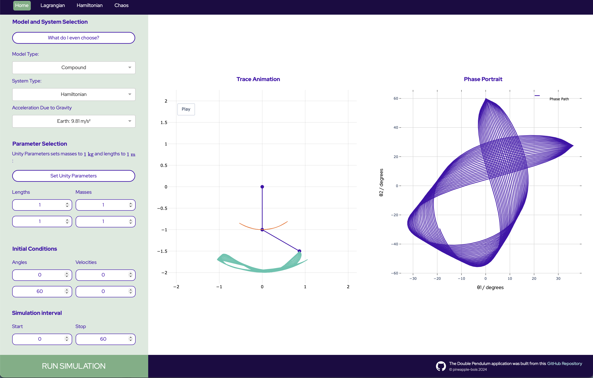

# Double Pendulum App

### This repo serves a [`Plotly Dash`](https://dash.plotly.com) application built on [`Flask`](https://flask.palletsprojects.com/en/3.0.x/) which is deployed with [`Heroku`](https://www.heroku.com). 



### It is available at: [www.double-pendulum.net](http://www.double-pendulum.net)

The application is an extension of [Double_Pendulum](https://github.com/pineapple-bois/Double_Pendulum), which derived the symbolic equations of motion.

----

### Physics of a double pendulum


#### The above figure shows `Simple` and `Compound` pendulum models. 
Both models move in the $(x,y)$-plane and the systems have two degrees of freedom. The motion is uniquely determined by the values of $\theta_1$ and $\theta_2$

`Simple Model`: 

- The rods $OP_1$ and $P_1P_2$ are rigid, massless and inextensible.
- Masses at $P_1$ and $P_2$ are subject to a uniform acceleration due to gravity.

`Compound Model`:

- Masses $M_1$ and $M_2$ are uniformly distributed along rod lengths $l_1$ and $l_2$. 
- Each rod is subject to a rotational kinetic energy and moment of inertia about its centre of mass. 
- Applying the parallel axis theorem, we account for the rotational dynamics about the pendulum ends.

The effects of any dissipative forces such as air resistance or friction are neglected therefore, the total mechanical energy is conserved. 

----

### Mathematical formulation

For this conservative system, the equations of motion are derived from Lagrangian, $\mathcal{L}$ which is given,

$$\mathcal{L}=T-V$$

Where $T$ is the kinetic energy and $V$ is the potential energy.

#### Forming a system of differential equations

1. `Lagrangian System`

We solve the Euler-Lagrange equations for $\textbf{q} = [\theta_1, \theta_2]$ such that, 

$$
\frac{\text{d}}{\text{d}t}\left(\frac{\partial L}{\partial \dot{\textbf{q}}}\right)-\frac{\partial L}{\partial \textbf{q}}=0
$$

The result is a system of $|\textbf{q}|$ coupled, second-order differential equations.

Uncoupling the equations involves extensive algebra and can be found in this [Python derivation](https://github.com/pineapple-bois/Double_Pendulum/blob/master/DerivationLagrangian.ipynb)

2. `Hamiltonian System`

The Hamiltonian $\mathcal{H}$ is the Legendre transformation of the Lagrangian and is given, 

$$
\mathcal{H} = \sum_{i=1}^2  \dot{\theta_i} p_{\theta_i} - \mathcal{L}
$$

Here, generalised velocities $\dot{\mathbf{q}}_i$ are replaced with generalised momenta $\mathbf{p}=\frac{\partial \mathcal{L}}{\partial \dot{\mathbf{q}}_i}$ and we form the equations of motion,

$$
\dot{\theta}_i=\frac{\partial \mathcal{H}}{\partial p_{\theta_i}}
$$

$$
\dot{p}_{\theta_i}=-\frac{\partial \mathcal{H}}{\partial \theta_i}
$$

Hamilton's equations are first-order and the [derivation](https://github.com/pineapple-bois/Double_Pendulum/blob/master/DevelopmentHamiltonian.ipynb) proved simpler than uncoupling the Euler-Lagrange equations. In this instance, the Hamiltonian was the first integral of the Lagrangian, representing total energy of the system. For $\textbf{q} = [\theta_1, \theta_2]$,

$$
\mathcal{H}(\mathbf{p}, \mathbf{q}) = \sum_{i=1}^2  \dot{q}_i p_{i} - \mathcal{L}(\mathbf{q}, \dot{\mathbf{q}}_i) \equiv T+V \equiv E_{\text{mech}}
$$

#### Solving the equations of motion

Closed-form, analytical solutions of the double pendulum system are not known to exist. The system must be integrated numerically. 

----

## The Application

This application represents a hybrid of web-development and dashboard engineering all written in Python. CSS code handles the styling of elements.

#### Main Features

- **Deriving the equations**: 
  - The equations of motion are derived symbolically with `SymPy` and abstracted as a series of [dependent functions](https://github.com/pineapple-bois/Double_Pendulum_App/blob/main/MathFunctions.py). 
  - A simple conditional logic structure controls which model is derived.
- **DoublePendulum Class**:
  - Instantiating a [DoublePendulum](https://github.com/pineapple-bois/Double_Pendulum_App/blob/main/DoublePendulum.py) object; *clicking the `Run Simulation` button*, derives the symbolic equations "on-the-fly".
  - The equations are cached to reduce runtime for further simulations of the same model.
  - The equations are numerically integrated using `SciPy`'s [solve_ivp](https://docs.scipy.org/doc/scipy/reference/generated/scipy.integrate.solve_ivp.html) function. Integrator arguments are available in the class structure but this functionality is yet to be added to the UI.
- **Visualisation**: 
  - Figures are rendered with `Plotly` and `Matplotlib`.
  - [`MathJax`](https://www.mathjax.org) API is used for $\LaTeX$ rendering.
- **Error Handling**: 
  - Robust validation of user inputs, ensures computational load is never too high.

#### Directory Structure

```
Double_Pendulum_App/
├── assets/
│   ├── Images/
│   │   ├── github-mark.png
│   │   ├── Model_Compound_Transparent_NoText.png
│   │   ├── Model_Simple_Transparent_NoText.png
│   │   ├── Models_Joint_White.png
│   │   └── Screenshot.png
│   ├── MarkdownScripts/
│   │   ├── information.txt
│   │   ├── mathematics_hamiltonian.txt
│   │   └── mathematics_lagrangian.txt
│   ├── custom-header.html
│   ├── nav-bar.js
│   ├── scroll.js
│   └── styles.css
├── layouts/
│   ├── layout_404.py
│   ├── layout_chaos.py
│   ├── layout_main.py
│   ├── layout_math.py
│   └── layout_matplotlib.py
├── tests/
├── AppFunctions.py
├── DoublePendulumHamiltonian.py
├── DoublePendulumLagrangian.py
├── LICENSE.md
├── MathFunctions.py
├── pendulum_app.py
├── Procfile
├── README.md
├── requirements.txt
└── runtime.txt
```

- For Dash applications, several key files are often required to ensure proper deployment and operation:
  - `Procfile` specifies the command to run the app.
  - `runtime.txt` defines the Python version .
  - `requirements.txt` lists necessary dependencies.
- Dash applications automatically read and serve files located in the root of the assets/ directory:
  - `custom-header.html` - Defines the page meta-data.
  - `nav-bar.js` - Script to scroll to the top of the math pages.
  - `scroll.js` - Script triggered by the "Run Simulation" button scrolls to the input/figures section of the page.
  - `styles.css` - Handles app styles such as fonts, colours, media queries, and layout structure.
- The `layouts/` directory contains a series of nested python functions that all return `dash.html.Div` objects:
  - Dash applications are designed to be single page dashboards. By abstracting the page layout as `layouts/`, the pathname is tracked by dash callbacks producing this pseudo-multi-page web application.

----

## Future Development

The [chaos/non-linear dynamics page](https://www.double-pendulum.net/chaos) is a work in progress. 

Development of new features will take place in the [Double_Pendulum_App_Development](https://github.com/pineapple-bois/Double_Pendulum_App_Development) repo which aims to;

1. Produce a semi-structured database of angles, velocities, positions, and momenta within specified bounds using the Hamiltonian derivation.
2. Produce bifurcation diagrams, and Poincaré sections to qualitatively analyse periodicity.
3. Analyse the truncation error of the numerical integration.
4. Analyse orbits quantitatively using Lyapunov exponents.


----


### Running the App Locally

#### 1. Fork and Clone the Repository

- Fork the [Double Pendulum App repository](https://github.com/pineapple-bois/Double_Pendulum_App) on GitHub.
- Clone your forked repository:

```bash
  git clone <your-forked-repo-url>
  cd Double_Pendulum_App
```

#### 2. Set Up a Virtual Environment

```bash
python3 -m venv env
source env/bin/activate   # On macOS/Linux
.\env\Scripts\activate    # On Windows
```

#### 3. Install Dependencies

```bash
pip install -r requirements.txt
```

#### 4. Stage For Development

- In the [`pendulum_app.py`](pendulum_app.py) file;

```python
# Comment out all below (from line 43)

@server.before_request
def before_request():
    if not request.is_secure:
        url = request.url.replace('http://', 'https://', 1)
        return redirect(url, code=301)
```
```python
# Optionally set debug=True below (line 320)

if __name__ == '__main__':
    app.run_server(debug=False)
```
#### 5. Run the Application

```bash
python pendulum_app.py
```

#### 6. Access the app at http://127.0.0.1:8050/ (The development server)

----

## Deployed Application @ [double-pendulum.net](http://www.double-pendulum.net)

For a full list of dependencies, refer to the `requirements.txt` file.

----

[](LICENSE.md) [](https://pineapple-bois.github.io)

----
