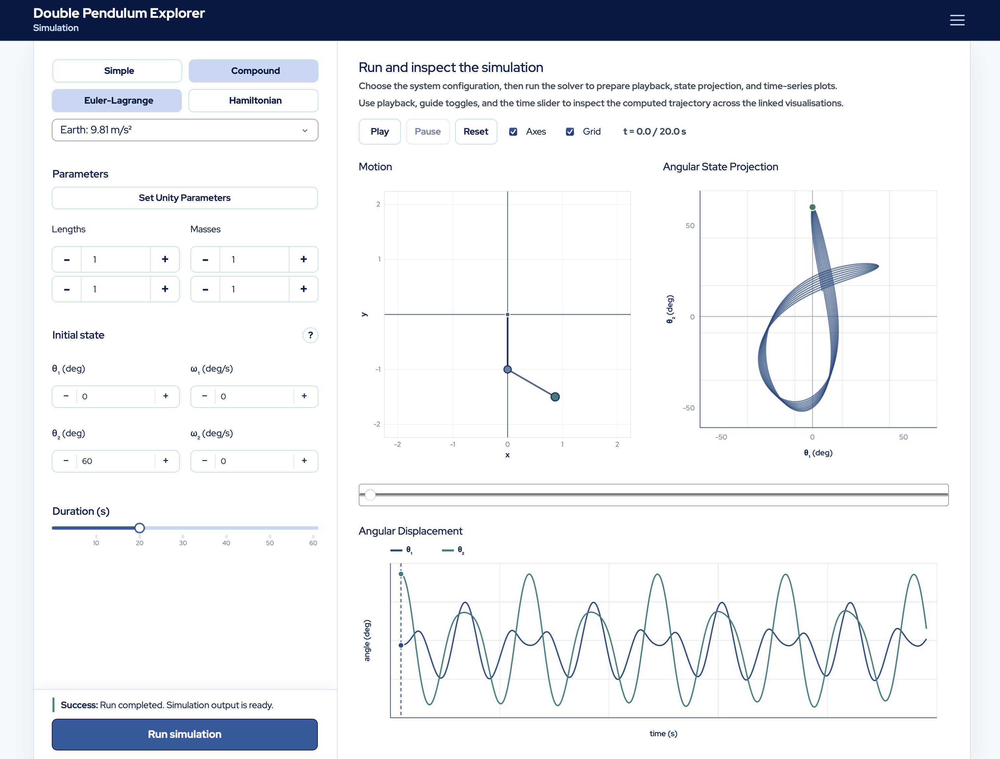
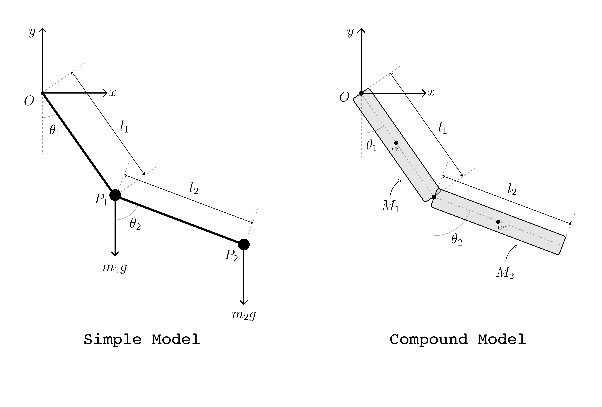

# Double Pendulum App

#### This repo serves a [`Plotly Dash`](https://dash.plotly.com) application built on [`Flask`](https://flask.palletsprojects.com/en/3.0.x/) and deployed on Railway. Active development is modernizing the app while preserving the current public deployment path.



#### It is available at: [www.double-pendulum.net](http://www.double-pendulum.net)

The application is an extension of [Double_Pendulum](https://github.com/pineapple-bois/Double_Pendulum), which derived the symbolic equations of motion.

For the current modernization direction, see [`ROADMAP.md`](ROADMAP.md). For
durable production architecture and workflow notes, see
[`documentation/`](documentation/).

----

### Physics of a double pendulum



#### The above figure shows `Simple` and `Compound` pendulum models. 
Both models move in the $(x,y)$-plane and the systems have two degrees of freedom. The motion is uniquely determined by the values of $\theta_1$ and $\theta_2$

`Simple Model`: 

- The rods $OP_1$ and $P_1P_2$ are rigid, massless and inextensible.
- Masses at $P_1$ and $P_2$ are subject to a uniform acceleration due to gravity.

`Compound Model`:

- Masses $M_1$ and $M_2$ are uniformly distributed along rod lengths $l_1$ and $l_2$. 
- Each rod is subject to a rotational kinetic energy and moment of inertia about its centre of mass. 
- Applying the parallel axis theorem, we account for the rotational dynamics about the pendulum ends.

The effects of any dissipative forces such as air resistance or friction are neglected therefore, the total mechanical energy is conserved. 

----

### Mathematical formulation

For this conservative system, the equations of motion are derived from Lagrangian, $\mathcal{L}$ which is given,

$$\mathcal{L}=T-V$$

Where $T$ is the kinetic energy and $V$ is the potential energy.

#### Forming a system of differential equations

1. `Lagrangian System`

We solve the Euler-Lagrange equations for $\textbf{q} = [\theta_1, \theta_2]$ such that, 

$$
\frac{\text{d}}{\text{d}t}\left(\frac{\partial L}{\partial \dot{\textbf{q}}}\right)-\frac{\partial L}{\partial \textbf{q}}=0
$$

The result is a system of $|\textbf{q}|$ coupled, second-order differential equations.

Uncoupling the equations involves extensive algebra and can be found in this [Python derivation](https://github.com/pineapple-bois/Double_Pendulum/blob/master/DerivationLagrangian.ipynb)

2. `Hamiltonian System`

The Hamiltonian $\mathcal{H}$ is the Legendre transformation of the Lagrangian and is given, 

$$
\mathcal{H} = \sum_{i=1}^2  \dot{\theta_i} p_{\theta_i} - \mathcal{L}
$$

Here, generalised velocities are replaced with generalised momenta and we form the equations of motion,

$$
\dot{\theta_i}=\frac{\partial \mathcal{H}}{\partial p_{\theta_i}}
$$

$$
\dot{p}_{\theta_i}=-\frac{\partial \mathcal{H}}{\partial \theta_i}
$$

Hamilton's equations are first-order and the [Python derivation](https://github.com/pineapple-bois/Double_Pendulum/blob/master/DevelopmentHamiltonian.ipynb) proved simpler than uncoupling the Euler-Lagrange equations. 

In this instance, the Hamiltonian was the first integral of the Lagrangian, representing total energy of the system. For $\textbf{q} = [\theta_1, \theta_2]$,

$$
\mathcal{H}(\mathbf{p}, \mathbf{q}) = \sum_{i=1}^2  \dot{q_i} p_{i} - \mathcal{L}(\mathbf{q}, \dot{\mathbf{q}}) \equiv T+V \equiv E_{\text{mech}}
$$

#### Solving the equations of motion

Closed-form, analytical solutions of the double pendulum system are not known to exist. The system must be integrated numerically. 

----

## The Application

This application represents a hybrid of web-development and dashboard
engineering. The active architecture is a Dash application shell with
callback-owned interaction state, Python backend simulation/model code, and a
Canvas-based Simulation renderer fed by Python-built payloads.

#### Main Features

- **Deriving the equations**: 
  - The equations of motion are derived symbolically with `SymPy` and abstracted as reusable helpers under `src/double_pendulum/math/`.
  - A simple conditional logic structure controls which model is derived.
- **DoublePendulum Class**:
  - Instantiating a Lagrangian or Hamiltonian double-pendulum model object; *clicking the `Run Simulation` button*, derives the symbolic equations "on-the-fly".
  - The equations are cached to reduce runtime for further simulations of the same model.
  - The equations are numerically integrated using `SciPy`'s [solve_ivp](https://docs.scipy.org/doc/scipy/reference/generated/scipy.integrate.solve_ivp.html) function. Integrator arguments are available in the class structure but this functionality is yet to be added to the UI.
- **Visualisation**: 
  - The production Simulation page now uses a Canvas renderer for motion,
    angular displacement, and angular state projection playback from
    Python-built payloads.
  - `Plotly` and `Matplotlib` remain dependencies for retained plotting helpers
    and future richer analytical inspection, but legacy Plotly outputs are no
    longer generated in the normal Simulation run flow.
  - [`MathJax`](https://www.mathjax.org) API is used for rendering latex expressions.
- **Error Handling**: 
  - Robust validation of user inputs, ensures computational load is never too high.

The Canvas integration does not imply that the numerical science is fully
validated. Energy diagnostics, chaos diagnostics, tolerance sensitivity,
solver-method equivalence, and long-duration scientific validity remain
deferred modernization work.

#### Directory Structure

```
Double_Pendulum_App/
├── assets/
│   ├── Images/
│   │   ├── github-mark.png
│   │   ├── Model_Compound_Transparent_NoText.png
│   │   ├── Model_Simple_Transparent_NoText.png
│   │   ├── Models_Joint_White.png
│   │   └── Screenshot.png
│   ├── MarkdownScripts/
│   │   ├── information.txt
│   │   ├── mathematics_hamiltonian.txt
│   │   └── mathematics_lagrangian.txt
│   ├── custom-header.html
│   ├── nav-bar.js
│   ├── scroll.js
│   ├── simulation-canvas-renderer.js
│   └── styles.css
├── app/
│   ├── callbacks/
│   ├── components/
│   ├── content/
│   ├── pages/
│   └── serialization/
├── documentation/
├── src/
│   └── double_pendulum/
│       ├── math/
│       ├── models/
│       ├── plotting/
│       └── validation/
├── tests/
├── LICENSE.md
├── ROADMAP.md
├── pendulum_app.py
├── Procfile
├── pyproject.toml
├── README.md
├── uv.lock
└── .python-version
```

- Deployment/runtime files:
  - `Procfile` declares the production process command.
  - `.python-version` defines the supported Python runtime.
  - `pyproject.toml` declares runtime and development dependencies.
  - `uv.lock` is the authoritative resolved dependency lockfile.
  - `runtime.txt` has intentionally been removed and should not be reintroduced.
- Dash applications automatically read and serve files located in the root of the assets/ directory:
  - `custom-header.html` - Defines the page meta-data.
  - `nav-bar.js` - Script to scroll to the top of the math pages.
  - `scroll.js` - Script triggered by the "Run Simulation" button scrolls to the input/figures section of the page.
  - `simulation-canvas-renderer.js` - Browser-side Canvas rendering, playback, and selected-frame inspection for Python-built simulation payloads.
  - `styles.css` - Handles app styles such as fonts, colours, media queries, and layout structure.
- The `app/` package contains Dash-facing application code:
  - `app/pages/` owns route-level page layouts.
  - `app/components/` owns reusable UI shell, controls, graph wrappers, references, and figure styling.
  - `app/content/` owns user-facing copy, page metadata, markdown paths, and reference data.
  - `app/callbacks/` owns routing and simulation callback registration.
  - `app/serialization/` owns the Canvas payload API used by the Simulation page.
- The `src/double_pendulum/` package is the home for reusable simulation, symbolic math, validation, and plotting/helper logic.
- The `documentation/` directory is the durable architecture/workflow reference for production-facing decisions, including the current Canvas Simulation architecture under [`documentation/simulation-canvas/`](documentation/simulation-canvas/).

----

### Future Development

The [chaos/non-linear dynamics page](https://www.double-pendulum.net/chaos) is a work in progress. 

The active product and architecture direction is tracked in [`ROADMAP.md`](ROADMAP.md). The local `development/` directory may contain ignored exploratory/reference work, including Simulation Workbench, math-fidelity, and solver-contract evidence. Durable summaries live under [`documentation/`](documentation/), and accepted findings should be encoded in production code and tracked tests.

The current roadmap continues from the deployed Simulation baseline. Phase 9
established the production layout and deployment hooks; Phase 10 is focused on
the chaos-analysis framework before any production Chaos page redesign.

Future chaos work aims to:

1. Produce a semi-structured database of angles, velocities, positions, and momenta within specified bounds using the Hamiltonian derivation.
2. Produce bifurcation diagrams, and Poincaré sections to qualitatively analyse periodicity.
3. Analyse the truncation error of the numerical integration.
4. Analyse orbits quantitatively using Lyapunov exponents.


----


### Running the App Locally

#### 1. Fork and Clone the Repository

- Fork the [Double Pendulum App repository](https://github.com/pineapple-bois/Double_Pendulum_App) on GitHub.
- Clone your forked repository:

```bash
  git clone <your-forked-repo-url>
  cd Double_Pendulum_App
```

#### 2. Install the Managed Environment

```bash
uv sync
```

`uv` reads Python 3.12 from `.python-version`, creates the project environment,
and installs the exact dependency versions recorded in `uv.lock`, including the
development dependency group.

#### 3. Configure Local and Deployment Flags

Local HTTP development does not redirect by default. Deployment-specific HTTPS
redirects are controlled by the `FORCE_HTTPS` environment flag in
[`app/config.py`](app/config.py); set `FORCE_HTTPS=true` only when the server
should redirect plain HTTP requests to HTTPS. The direct local run debug flag is
controlled separately with `DASH_DEBUG`; leave it false for deployment-style
checks and set `DASH_DEBUG=true` only for local development.

Railway uses the tracked production process declaration:

```bash
web: gunicorn pendulum_app:server
```

Set deployment environment variables in Railway rather than editing
`pendulum_app.py`.

#### 4. Run the Application Safely

```bash
uv run python pendulum_app.py
```

For Dash debug mode during local development:

```bash
DASH_DEBUG=true uv run python pendulum_app.py
```

#### 5. Access the app at http://127.0.0.1:8050/ (The development server)

Before starting the Dash app for a smoke check, confirm port `8050` is not
already occupied:

```bash
lsof -nP -iTCP:8050 -sTCP:LISTEN
```

If port `8050` is already occupied, do not blindly kill the process. Identify
it if possible, or choose a clearly documented temporary port only when
appropriate.

If you start the Dash development server, capture the process ID, stop that
exact process after testing, and verify you did not leave a Flask/Dash process
running. This cleanup rule is more important than completing a browser smoke
check.

----

### Vendored MathJax

Equation rendering uses MathJax 3.2.0 from
`assets/vendor/mathjax-3.2.0/`. Dash discovers the combined
`tex-mml-chtml.js` entry through the configured root assets directory and emits
a prefix-aware local asset URL. CommonHTML fonts are served from the matching
`output/chtml/fonts/woff-v2/` directory. No MathJax runtime request depends on
an external CDN.

The vendored files come from the official `mathjax@3.2.0` npm package. To
refresh the pinned distribution:

1. Run `npm pack mathjax@3.2.0 --pack-destination /private/tmp` outside the
   repository and extract the tarball there.
2. Copy only `es5/tex-mml-chtml.js`,
   `es5/output/chtml/fonts/woff-v2/*.woff`, and `LICENSE` into
   `assets/vendor/mathjax-3.2.0/` with the `es5/` prefix removed.
3. Run the full tests and browser/network checks.

Do not copy the npm source tree or `node_modules`. Verify that the vendored
`LICENSE` contains the upstream Apache License 2.0 text and that the runtime and
fonts are unchanged from the official package.

----

### Running the Test Suite

Synchronize the locked runtime and development dependencies:

```bash
uv sync
```

Run the full test suite with:

```bash
uv run pytest
```

For Simulation UI work, a manual/browser smoke check should cover a simple
valid run, Canvas rendering, playback controls, stale state after input changes,
and invalid-input validation. See
[`documentation/development-workflow.md`](documentation/development-workflow.md)
for the full safe smoke-test procedure.

The current test layout is organized by purpose:

- `tests/unit/` covers validation and lightweight symbolic fidelity checks.
- `tests/integration/` covers app import, route layout smoke behavior, and the Flask `server` object used by Gunicorn.
- `tests/numerical/` covers basic Lagrangian and Hamiltonian simulation shape, finite values, and initial-condition consistency.

Validation scope note: these tests support deployment and modernization work,
but they are not a complete numerical validation project. Full derivation
audits, compound-equation symbolic checks, energy-conservation tolerances,
trajectory regression fixtures, and a Hamiltonian state/input convention audit
remain scientific-validation work rather than deployment blockers.

----

### Project Dependencies

#### Core Libraries
- `dash`

#### Web Server and Framework
- `Flask`
- `gunicorn`

#### Math and Science Libraries
- `numpy`
- `scipy`
- `sympy`

#### Visualisation
- `matplotlib`
- `plotly`

[`pyproject.toml`](pyproject.toml) declares top-level runtime dependencies and a
development dependency group. [`uv.lock`](uv.lock) is the authoritative resolved
environment used for local development, tests, and deployment. Update the lock
with `uv lock` after changing dependency declarations.

The old fully frozen dependency list is preserved in
[`requirements-old-freeze.txt`](legacy/requirements-old-freeze.txt) as historical
reference only; it is not an active dependency source.

----

[](LICENSE.md) [](https://pineapple-bois.github.io)

----
