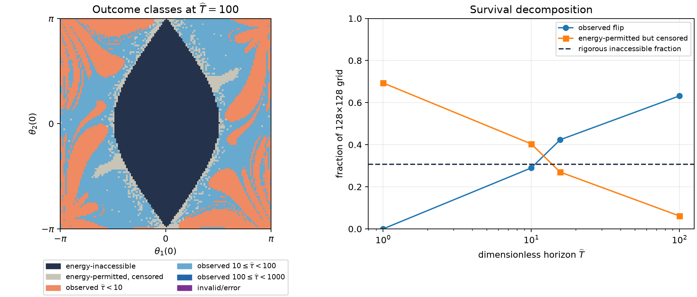

# First-flip horizon and energy accessibility

## Decision summary

Use a next authoritative first-flip horizon of

$$
\widehat T_{\max}=100,
\qquad
T_{\max}=100\sqrt{\frac{1}{9.81}}
=31.9275428407\ \mathrm{s}.
$$

On the 128×128 periodic zero-velocity grid, this accepted horizon populates two
useful event-time decades: 4,748 cells (28.98%) in
$1\leq\widehat\tau<10$ and 5,609 cells (34.23%) in
$10\leq\widehat\tau<100$. No cell flips before $\widehat\tau=1$.
The $\widehat T=100$ field costs 20.70 s wall time, 1.380× the measured 5 s
coarse-field wall cost.

An extra $\widehat T=1000$ probe produced only 663 additional events (4.05% of
the grid) at 4.716× the 5 s wall cost and failed the existing native-versus-
trusted tail-equivalence gate. It is rejected exploratory evidence, not a
candidate production specification.

## A. Energy accessibility

For absolute link angles measured from the downward vertical, the simple-model
energy is

$$
\begin{aligned}
E={}&\frac12(m_1+m_2)\ell_1^2\omega_1^2
+\frac12m_2\ell_2^2\omega_2^2
+m_2\ell_1\ell_2\omega_1\omega_2\cos(\theta_1-\theta_2)\\
&-(m_1+m_2)g\ell_1\cos\theta_1
-m_2g\ell_2\cos\theta_2.
\end{aligned}
$$

Write

$$
A=(m_1+m_2)g\ell_1,
\qquad
B=m_2g\ell_2,
\qquad
V=-A\cos\theta_1-B\cos\theta_2.
$$

The kinetic quadratic form is nonnegative. A continuous lifted arm-1 net
$\pm2\pi$ revolution must cross $\theta_1=\pi\pmod{2\pi}$. At that crossing,

$$
E\geq V\geq A-B.
$$

Likewise, an arm-2 revolution must cross
$\theta_2=\pi\pmod{2\pi}$, where

$$
E\geq V\geq -A+B.
$$

Therefore a flip by either link requires

$$
E\geq \min(A-B,-A+B)=-|A-B|.
$$

For the actual unit/equal-mass/equal-link field, $A=2g$, $B=g$, so

$$
\text{either first flip requires }E\geq-g=-9.81\ \mathrm{J}.
$$

On the zero-velocity slice,

$$
E_0=-g\left(2\cos\theta_1(0)+\cos\theta_2(0)\right),
$$

and the rigorous inaccessible mask is

$$
E_0<-g
\quad\Longleftrightarrow\quad
2\cos\theta_1(0)+\cos\theta_2(0)>1.
$$

The inequality is strict: saddle-energy equality is energy-accessible and is
not assigned to the mask. The result is a **necessary** energy condition for a
flip, not a sufficient condition. Equivalently, failing it is sufficient to
prove that neither link ever completes the defined revolution. Passing it only
means that conservation of energy does not forbid a winding path; it does not
prove that the unique trajectory will take that path. Energy also does not
identify special non-flipping invariant trajectories outside the strict mask.

The 128×128 mask contains 5,023 cells (30.65796%). All 5,023 remain censored at
every tested horizon, and zero observed event lies inside the mask. This is a
consistency check, not the proof; the proof is the barrier argument above.

The outcome vocabulary is therefore:

- `energy_inaccessible`: rigorously no first flip at any time by conservation
  of energy;
- `energy_permitted_right_censored`: not forbidden, but no flip observed by the
  declared finite horizon;
- `event_observed`: a qualifying first-flip root was located;
- invalid/error: a numerical result that cannot be classified as censoring.

## B. Long-horizon survival

The experiment independently evaluated the same half-open periodic 128×128
grid at each accepted horizon. Fractions use all 16,384 cells. `New` is the
event population not observed at the preceding listed horizon.

| $\widehat T$ | $T$ / s | Observed | Censored | Invalid/error | New | Wall / s | Evaluation / s | Wall cells/s | Evaluation cells/s |
| ---: | ---: | ---: | ---: | ---: | ---: | ---: | ---: | ---: | ---: |
| 1 | 0.319275 | 0 (0.00%) | 16,384 (100.00%) | 0 | 0 | 14.01 | 11.10 | 1,169.7 | 1,476.4 |
| 10 | 3.192754 | 4,748 (28.98%) | 11,636 (71.02%) | 0 | 4,748 | 14.80 | 11.84 | 1,106.8 | 1,383.8 |
| 15.660460 | 5.000000 | 6,940 (42.36%) | 9,444 (57.64%) | 0 | 2,192 | 15.00 | 12.06 | 1,092.1 | 1,358.0 |
| 100 | 31.927543 | 10,357 (63.21%) | 6,027 (36.79%) | 0 | 3,417 | 20.70 | 17.72 | 791.3 | 924.7 |

Candidate logarithmic-bin populations at each horizon were:

| $\widehat T$ | $\widehat\tau<1$ | $1\leq\widehat\tau<10$ | $10\leq\widehat\tau<100$ | $100\leq\widehat\tau<1000$ |
| ---: | ---: | ---: | ---: | ---: |
| 1 | 0 | 0 | 0 | 0 |
| 10 | 0 | 4,748 (28.98%) | 0 | 0 |
| 15.660460 | 0 | 4,748 (28.98%) | 2,192 (13.38%) | 0 |
| 100 | 0 | 4,748 (28.98%) | 5,609 (34.23%) | 0 |

The $[10,100)$ count at the 5 s row is naturally truncated by that row's
$\widehat T=15.660460$ observation cap; it is not the full decade population.

Observed dimensionless event-time distributions were:

| $\widehat T$ | min | q25 | median | q75 | q90 | q99 | max |
| ---: | ---: | ---: | ---: | ---: | ---: | ---: | ---: |
| 10 | 3.5268 | 4.9065 | 5.9208 | 7.3985 | 8.9524 | 9.9194 | 9.9994 |
| 15.660460 | 3.5268 | 5.3817 | 7.2641 | 10.7158 | 13.6266 | 15.4946 | 15.6596 |
| 100 | 3.5268 | 6.1314 | 10.6913 | 20.4245 | 36.6029 | 87.5982 | 99.9372 |

At $\widehat T=100$, the 6,027 censored cells split into all 5,023 rigorous
energy-inaccessible cells and 1,004 energy-permitted censored cells. Thus the
inaccessible set is 83.34% of the survivor set; the other 16.66% remains only
right-censored. Spatially, the inaccessible mask is a broad central region,
while the permitted survivors appear as smaller islands and narrow boundary
features outside it. The surviving set approaches the mask as the horizon
increases, but no asymptotic conclusion follows from that geometry.

The diagnostic below is intentionally a decision aid rather than a polished
pedagogical gallery.



## C. Numerical and operational feasibility

The production dispatcher still rejects every non-T=5 definition. The
investigation-local route directly exercises the immutable corrected-v2 native
DOP853 artifact; it does not modify the dispatcher, field adapter, route
vocabulary, or allowlist. It preserves the unit parameters, zero velocities,
DOP853 `rtol=1e-9`, `atol=1e-11`, $\max\Delta t=t_g/32$, four signed terminal
events, strict capped-event semantics, diagnostics, and existing gates.

All accepted fields had exactly 16,384 investigation-native results, zero
fallback, zero invalid/error cells, eight pools, seven recycling events, and
clean worker shutdown. Across the accepted horizons the maxima remained within
the existing gates:

- normalized energy drift: $8.252\times10^{-10}<5\times10^{-9}$;
- accepted angular increment: $0.13536<0.5$ rad;
- triggering residual: $9.060\times10^{-14}<10^{-10}$;
- solver max-step excess: within the existing $2\times10^{-14}$ s allowance.

Twelve named preflight comparisons passed before the fields were used. Eighteen
field-selected observed/censored comparisons then passed against the independent
Python `solve_ivp` RHS, including median and latest events, inaccessible and
permitted censored cells, and worst-energy cells. The accepted maximum event-
time difference was $1.745\times10^{-8}$ s and the maximum event-state component
difference was $6.790\times10^{-8}$, both at the latest $\widehat T=100$ event
and inside the unchanged gates.

### Rejected $\widehat T=1000$ probe

The optional 128×128 probe at $\widehat T=1000$ ($319.2754$ s) measured:

- 11,020 observed (67.26%), 5,364 censored (32.74%), zero cell-local
  invalid/error outcomes;
- 663 events in $100\leq\widehat\tau<1000$ (4.05% of the grid);
- 5,023 inaccessible plus 341 energy-permitted censored cells;
- 75.06 s wall, 72.09 s evaluation, 218.3 wall cells/s, and zero fallback;
- maximum energy drift $4.452\times10^{-9}$, close to the unchanged gate.

Its observed $\widehat\tau$ distribution was min 3.5268, q25 6.2892,
median 11.3888, q75 23.7982, q90 57.7219, q99 420.6584, and max 981.0353.
The complete bin counts were 4,748 in $[1,10)$, 5,609 in $[10,100)$, and
663 in $[100,1000)$; the $<1$ class remained empty.

However, the latest native event ($\widehat\tau=981.0353$) failed independent
equivalence. The trusted solver observed an arm-2 event 123.1008 s earlier and
with the opposite sign; the event-state difference was $4\pi$. This fails event
time, event state, and attribution gates even though each trajectory separately
passes energy/root/step diagnostics. The aggregate $\widehat T=1000$ population
is therefore exploratory only. No gate was weakened and no production
eligibility was broadened. See the
[tail evidence](evidence/first_flip_H1000_tail_validation.json).

## D. Roadmap usefulness

1. **Multiple decades are meaningfully populated.** The supported classes are
   $1\leq\widehat\tau<10$ (28.98%) and
   $10\leq\widehat\tau<100$ (34.23%). The proposed
   $\widehat\tau<1$ class is empty on this zero-velocity slice and should not be
   presented as a populated regime.
2. **The logarithmic classification adds information.** Relative to T=5,
   $\widehat T=100$ resolves 3,417 additional delayed flips (20.86% of the
   grid), separates broad rapid-flip regions from later bands/filaments, and
   decomposes the old censored colour into a rigorous central inaccessible
   region plus a much smaller permitted-censored remainder.
3. **Four concepts can be kept distinct.** Rapid observed flipping is the
   $[1,10)$ class; delayed observed flipping is $[10,100)$; 1,004 cells are
   energy-permitted but censored at 100; and 5,023 are rigorously inaccessible.
4. **A sufficient next field is $\widehat T=100$.** It supports threshold views
   at $\widehat H=1,10,100$ under the documented strict boundary convention and
   does not rely on the rejected extra decade.
5. **Another decade is not justified now.** It adds only 4.05% of grid cells,
   costs 4.716× T=5 at coarse resolution, moves close to the energy gate, and
   fails the long-tail native/reference numerical contract.

The roadmap narrative remains explicit:

```text
physical event
    ↓
event timescale
    ↓
thresholded outcome map
    ↓
finite-time sensitivity as a function of observation time
```

The recommended field gives later finite-time-stretching work physically
supported comparison horizons at $\widehat H=1$, 10, and 100. The first is an
all-no-event baseline, the second isolates rapid flips, and the third includes
the delayed decade. Matching finite-time stretching remains a separate
tangent-space experiment; nothing here implements or infers it.

## Production cost recommendation

The accepted 128×128 $\widehat T=100$ field is 1.380× the coarse exact-T=5 wall
cost. Applying that measured ratio to the existing corrected-native T=5
production manifests gives rough same-host estimates:

| Resolution | Existing T=5 wall | Estimated $\widehat T=100$ wall |
| ---: | ---: | ---: |
| 512×512 | 296.6 s | 409 s (6.8 min) |
| 1024×1024 | 1,180.3 s | 1,629 s (27.2 min) |
| 2048×2048 | 4,605.1 s | 6,356 s (106 min) |

These are linear extrapolations from measured route/pool behavior, not executed
large-field timings. Both 1024×1024 and 2048×2048 appear operationally
reasonable as resumable manual generation on the measured four-worker host;
1024×1024 is the lower-risk next authoritative run, while 2048×2048 is a
reasonable later refinement if the 1024 field validates cleanly. The next
production task still requires explicit promotion validation for the exact
$T=31.9275428407$ s specification; this investigation does not itself broaden
the guarded route.

## Artifacts and validation

- `first_flip_horizon_and_energy_accessibility.py`: bounded generator,
  classifier, validator, summarizer, and diagnostic renderer;
- `validate_exploratory_tail.py`: independent late/worst-drift tail audit;
- `evidence/first_flip_horizon_128.json` and `.npz`: accepted deterministic
  summary and arrays through $\widehat T=100$;
- `evidence/first_flip_horizon_128.png`: accepted decision diagnostic;
- `evidence/*H1000*`: explicitly rejected extra-decade evidence;
- `tests/test_first_flip_horizon_and_energy_accessibility.py`: energy,
  production-guard, population, monotonicity, checksum, and rejection checks.

Validation commands and results are recorded in the completion response and
can be repeated from the commands in this investigation's README.

LONG-HORIZON FIELD READY: 31.9275428407 s (dimensionless horizon 100)
